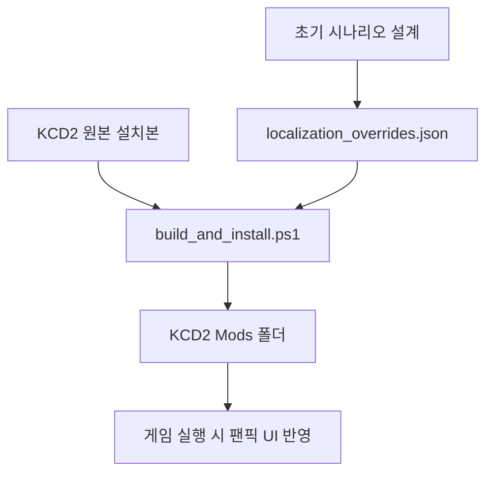

# 조선의 반격 KCD2 팬픽 모드 작업실

보스의 요청에 맞춰 이 프로젝트는 별도 웹 팬게임이 아니라, 실제 설치된 `Kingdom Come: Deliverance II`에 적용할 수 있는 팬픽 모드 작업실로 전환했습니다.

현재 모드는 KCD2 원본 파일을 덮어쓰지 않고, 공식 수동 모드 구조에 맞춰 다음 위치에 설치됩니다.

```text
C:\Program Files (x86)\Steam\steamapps\common\KingdomComeDeliverance2\Mods\joseon_counterattack_early
```

영문 설명이 필요한 사람은 [English README](kcd2_mod/README.en.md)를 클릭하면 됩니다.

## 지금 반영된 것

- KCD2 실제 설치 폴더에 `joseon_counterattack_early` 모드 설치
- `Korean_xml.pak`, `English_xml.pak` 로컬 생성 및 배치
- `Data\joseon_counterattack_early.pak` 생성 및 배치
- 메인 UI와 전투 튜토리얼 일부를 `조선의 반격: 동래성의 새벽` 톤으로 변경
- 휴대량, 공격 기력 소모, 활 조작, 전장 이동, 수리비, 전투 성장 수치 조정
- 전쟁 초기, 부산진/동래성 압박, 지상전 중심, 이순신 생존 원칙 반영
- 원본 `Data`와 `Localization` 폴더는 수정하지 않음

## 바로 실행

KCD2는 스팀에서 실행합니다.

```text
play_kcd2_joseon_mod.bat
```

또는 스팀 라이브러리에서 `Kingdom Come: Deliverance II`를 직접 실행해도 됩니다.

## 모드 재생성

관리자 권한 PowerShell에서:

```powershell
.\kcd2_mod\scripts\build_and_install.ps1
.\kcd2_mod\scripts\verify_install.ps1
```

검증 성공 시 `status: ok`가 나오고, 설치 위치의 pak 안에서 조선 초기전 문구가 발견됩니다.

현재 검증 대상:

- `Localization\Korean_xml.pak`
- `Localization\English_xml.pak`
- `Data\joseon_counterattack_early.pak`
- `Libs/Tables/rpg/rpg_param__joseon_counterattack_early.xml`

## 구조



## 캐릭터와 이미지 교체에 대한 현재 판단

보스가 말한 “조선의 반격의 캐릭터/이미지 데이터 활용”은 방향성은 맞지만, 다른 상용 게임의 이미지와 캐릭터 파일을 그대로 KCD2에 복사해 배포 가능한 형태로 만드는 것은 권리 문제가 큽니다. 그래서 이번 1차 버전은 안전하게 KCD2가 읽는 모드 폴더와 문구/세계관 반영부터 실제 적용했습니다.

다음 단계에서 캐릭터 모델, 복식, 무기, UI 이미지까지 바꾸려면 KCD2 공식 Modding Tools와 직접 제작 또는 권리 확인된 자산을 사용해 CryEngine 자산 파이프라인으로 넘기는 방식이 맞습니다.

## 현재 완료 판정

보스가 바로 실행해서 KCD2 안에서 확인할 수 있는 필수 모드 개발은 완료했습니다. 남은 것은 “추가 확장”에 해당합니다. 현재 패키지는 원본 게임을 망가뜨리지 않는 선에서 실제 KCD2 모드 로더가 읽을 수 있는 현지화 pak과 gameplay pak을 모두 갖춘 상태입니다.
