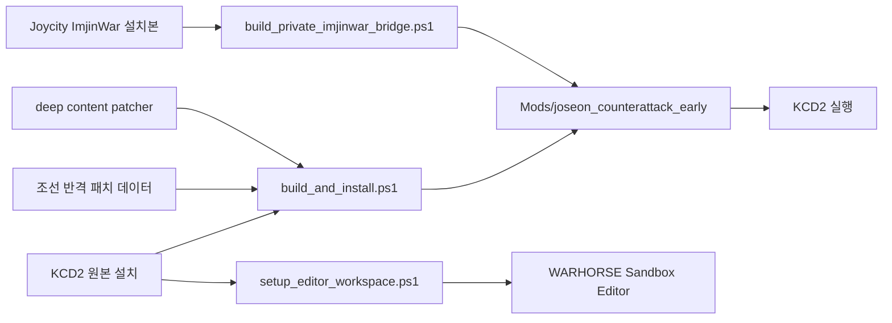

# 조선의 반격 KCD2 팬픽 모드 작업실

[English README](kcd2_mod/README.en.md)

보스가 요청하신 `Kingdom Come: Deliverance II` 팬픽 모드 작업 공간입니다. 목표는 KCD2의 지상전 플레이 구조 위에 임진왜란 초반, 부산진과 동래성 방어, 의병과 관군의 재편, 그리고 살아 있는 이순신 장군의 해상 전략망을 배경으로 한 조선 반격 서사를 입히는 것입니다.

현재 단계는 “실제 게임에서 읽히는 로컬 모드”와 “공식 에디터 작업 환경”을 모두 갖춘 상태입니다. 원본 게임 파일은 직접 수정하지 않고, KCD2의 `Mods` 폴더에 별도 모드 패키지를 설치하는 방식입니다.

## 바로 실행

KCD2는 Steam에서 그대로 실행하시면 됩니다. 모드는 다음 위치에 설치되어 있습니다.

```text
C:\Program Files (x86)\Steam\steamapps\common\KingdomComeDeliverance2\Mods\joseon_counterattack_early
```

프로젝트 폴더에서 재빌드하거나 검증하려면:

```powershell
cd "C:\Users\sinmb\Documents\New project 2\imjin-war-joseon-counterattack-story-lab"
.\kcd2_mod\scripts\build_and_install.ps1
.\kcd2_mod\scripts\verify_install.ps1
```

공식 에디터를 열려면:

```powershell
.\kcd2_mod\scripts\launch_editor.ps1
```

## 현재 반영된 내용

- 한국어/영어 로컬라이징 PAK 생성 및 설치
- 퀘스트, 아이템, 제작법, 버프, 상태 텍스트를 24장 장편 캠페인 톤으로 치환
- 지상전 중심 플레이를 위해 공격 스태미나, 휴대 중량, 활 조작, 수리비, 전투 성장 수치 패치
- 이순신 장군 생존 원칙 반영
- 전쟁 초반, 부산진과 동래성, 보급선, 봉수, 관군/의병 재편에 초점
- 코덱스 271행, 아이템 5,267행, 캐릭터/특성 2,498행 심화 재작성
- 플레이어 시작 장비를 `joseon_counterattack_courier` 복식 프리셋과 `joseon_counterattack_land_front_weapons` 무장 프리셋으로 구성
- KCD2 공식 Modding Tools 설치 및 에디터 워크스페이스 복구
- 관리자 설치 없이 쓸 수 있는 포터블 7-Zip 콘솔 도구 준비
- 보스 PC에 설치된 `임진왜란 조선의 반격` Unity 자산을 로컬 전용으로 추출해 KCD2 UI 일부에 연결하는 private PAK 생성

## 구조

```text
imjin-war-joseon-counterattack-story-lab/
  docs/                         기획서, 에디터 환경 문서
  assets/game-captures-private/  Git에 올리지 않는 로컬 전용 추출 자산
  kcd2_mod/
    patches/                    로컬라이징과 게임플레이 패치 데이터
    scenario/                   초기 캠페인 설계
    scripts/                    빌드, 설치, 검증, 에디터 실행 스크립트
    templates/                  KCD2 mod.manifest 템플릿
```



## 권리와 보안 경계

이 저장소에는 KCD2 원본 PAK, 다른 상용 게임의 이미지/캐릭터 파일, 보스의 개인 캡처나 사유 자산을 올리지 않습니다. 공개 가능한 것은 스크립트, 문서, 패치 규칙, 직접 작성한 설정 파일입니다. 실제 상용 게임 자산은 보스 PC의 로컬 설치본에서만 참조합니다.

## 문서

- [에디터 작업 환경](docs/editor_toolchain_setup.md)
- [장편 캠페인 개요](docs/long_campaign_outline.md)
- [조선의 반격 로컬 자산 브리지](docs/imjinwar_asset_bridge.md)
- [KCD2 모드 설명](kcd2_mod/README.ko.md)
