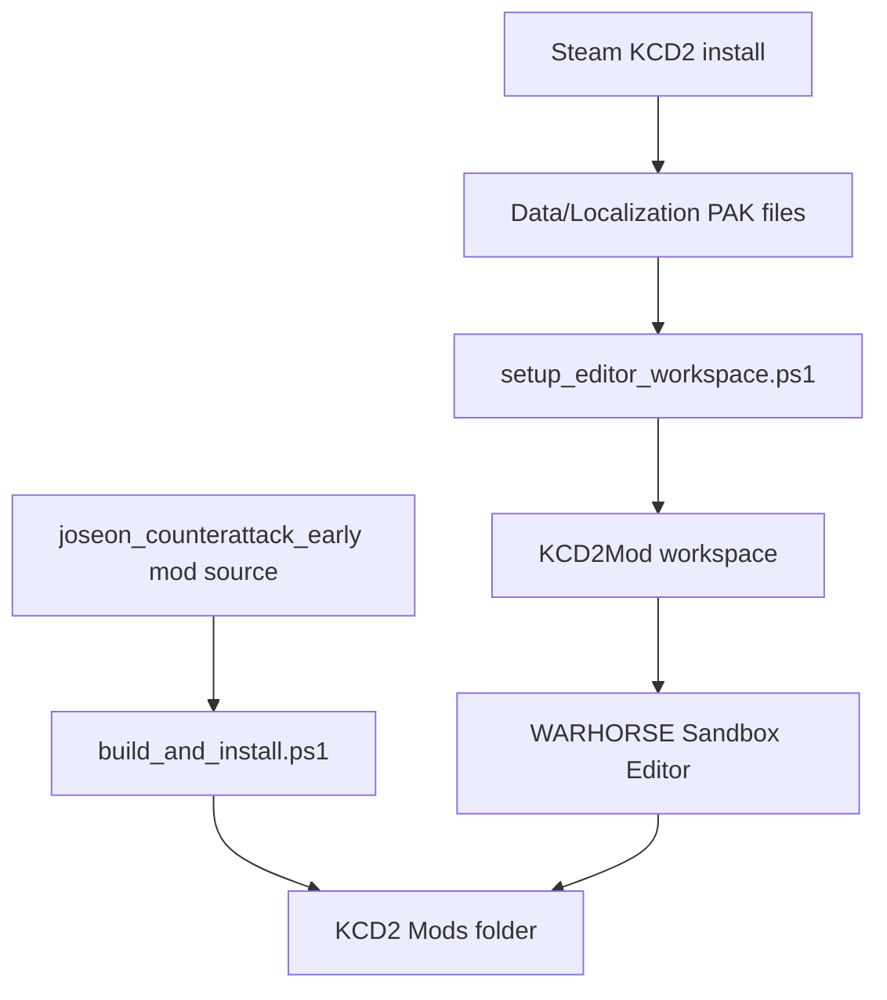

# KCD2 Editor Toolchain

[한국어](editor_toolchain_setup.md)

This document records the local editor setup for the Joseon Counterattack KCD2 fan mod on this PC.

## Current State

- Official modding tools: `C:\Program Files (x86)\Steam\steamapps\common\KCD2Mod`
- Editor executable: `C:\Program Files (x86)\Steam\steamapps\common\KCD2Mod\Bin\Win64ReleaseSteamLTO_DLL\Editor.exe`
- KCD2 game install: `C:\Program Files (x86)\Steam\steamapps\common\KingdomComeDeliverance2`
- Installed fan mod: `C:\Program Files (x86)\Steam\steamapps\common\KingdomComeDeliverance2\Mods\joseon_counterattack_early`
- Editor database fix: 94 game PAK files from `Data` and `Localization` are hard-linked into the modding tools workspace.
- Archive tool: portable console 7-Zip is available at `C:\Users\sinmb\workspace\tools\7zip\extra\7za.exe`.

## Workflow



## Commands

```powershell
cd "C:\Users\sinmb\Documents\New project 2\imjin-war-joseon-counterattack-story-lab"
.\kcd2_mod\scripts\setup_editor_workspace.ps1
.\kcd2_mod\scripts\ensure_portable_7zip.ps1
.\kcd2_mod\scripts\launch_editor.ps1
.\kcd2_mod\scripts\build_and_install.ps1
.\kcd2_mod\scripts\verify_install.ps1
```

## Notes

- Original game PAK files are not edited.
- Repacked KCD2 assets and third-party commercial game assets must not be published to GitHub.
- The official `WorkspaceSetup.exe` requires UAC. The local hard-link script replaces that step for this PC.
