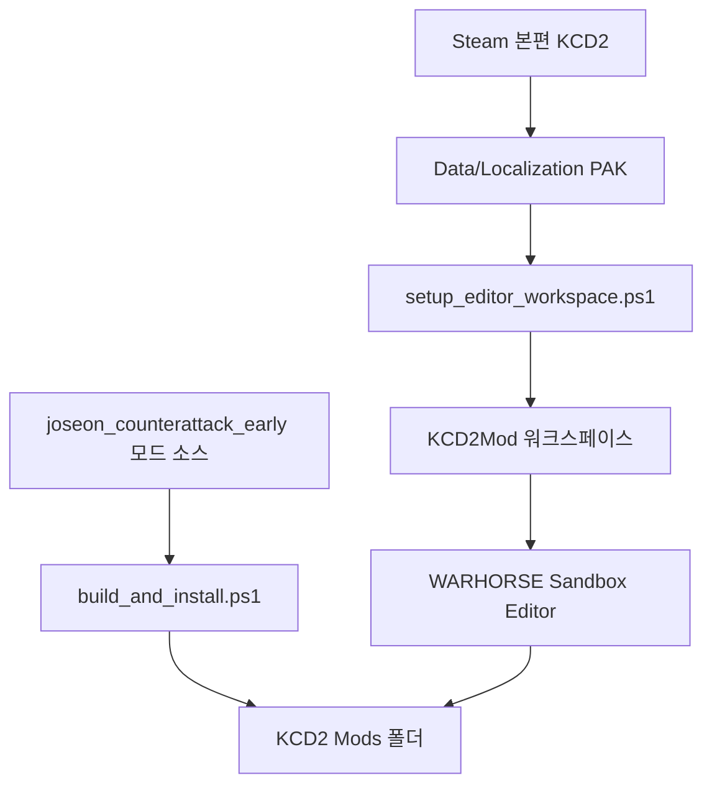

# KCD2 에디터 작업 환경

[English](editor_toolchain_setup.en.md)

이 문서는 보스 PC에 설치된 `Kingdom Come: Deliverance II`와 공식 `Kingdom Come: Deliverance II Modding tools`를 기준으로 정리한 에디터 작업 상태입니다.

## 현재 상태

- 공식 모딩툴 설치 위치: `C:\Program Files (x86)\Steam\steamapps\common\KCD2Mod`
- 에디터 실행 파일: `C:\Program Files (x86)\Steam\steamapps\common\KCD2Mod\Bin\Win64ReleaseSteamLTO_DLL\Editor.exe`
- 본편 설치 위치: `C:\Program Files (x86)\Steam\steamapps\common\KingdomComeDeliverance2`
- 적용 중인 팬픽 모드: `C:\Program Files (x86)\Steam\steamapps\common\KingdomComeDeliverance2\Mods\joseon_counterattack_early`
- 에디터 DB 오류 해결: 본편 `Data`와 `Localization`의 PAK 94개를 모딩툴 워크스페이스에 하드링크로 연결했습니다.
- 압축 도구: 관리자 설치 없이 `C:\Users\sinmb\workspace\tools\7zip\extra\7za.exe` 포터블 콘솔판을 준비했습니다.

## 작업 흐름



## 자주 쓰는 명령

프로젝트 루트:

```powershell
cd "C:\Users\sinmb\Documents\New project 2\imjin-war-joseon-counterattack-story-lab"
```

에디터 워크스페이스 복구:

```powershell
.\kcd2_mod\scripts\setup_editor_workspace.ps1
```

포터블 7-Zip 준비:

```powershell
.\kcd2_mod\scripts\ensure_portable_7zip.ps1
```

에디터 실행:

```powershell
.\kcd2_mod\scripts\launch_editor.ps1
```

팬픽 모드 재빌드와 검증:

```powershell
.\kcd2_mod\scripts\build_and_install.ps1
.\kcd2_mod\scripts\verify_install.ps1
```

## 주의

- 본편 원본 PAK는 수정하지 않습니다. 모딩툴 폴더에는 하드링크만 추가합니다.
- 다른 상용 게임의 이미지와 캐릭터 파일은 GitHub에 올리지 않습니다. 개인 PC에서 직접 추출하거나 만든 원본 자산만 로컬에서 사용합니다.
- `WorkspaceSetup.exe`는 UAC 창을 띄우며 자동 조작이 어렵습니다. 현재는 같은 효과를 내는 수동 하드링크 스크립트로 대체했습니다.
- 오래 떠 있는 `WorkspaceSetup.exe` UAC 창이 보이면 취소해도 됩니다. 이미 에디터 구동에 필요한 워크스페이스 연결은 완료됐습니다.
