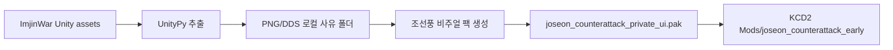

# 조선의 반격 자산 브리지

[English](imjinwar_asset_bridge.en.md)

보스 PC에서 `임진왜란 조선의 반격` 설치본을 확인했습니다.

```text
C:\Program Files (x86)\Joycity\ImjinWar
```

이 게임은 Unity/IL2CPP 기반이며, 이미지와 텍스트는 `IMClient\ImjinWar_Data` 아래 Unity `assets`, `resS`, `Addressables` 구조에 들어 있습니다. Steam 게임이 아니라 Joycity 설치본으로 등록되어 있습니다.

## 확인된 대표 자산

- `Logo_TitleScreen`
- `Atlas_IMJIN_Window_32bit`
- `KR_S_Sword_00_D`
- `Kr_House_Door_01_D`
- `Splash`
- `fx_fire_59a`
- `fx_slash_16b`
- `WaterColor_FieldOcean`

## 적용 방식

공개 저장소에는 상용 게임 자산을 넣지 않습니다. 대신 로컬에서만 다음 작업을 수행합니다.

```powershell
.\kcd2_mod\scripts\build_private_imjinwar_bridge.ps1
.\kcd2_mod\scripts\verify_private_imjinwar_bridge.ps1
.\kcd2_mod\scripts\verify_visual_asset_pack.ps1
```

이 스크립트는 다음을 만듭니다.

```text
assets\game-captures-private\imjinwar_extract\
C:\Program Files (x86)\Steam\steamapps\common\KingdomComeDeliverance2\Mods\joseon_counterattack_early\Data\joseon_counterattack_private_ui.pak
```

`assets\game-captures-private`는 Git에 올라가지 않습니다. 생성된 `joseon_counterattack_private_ui.pak`도 로컬 설치본에만 존재합니다.

## KCD2 쪽 매핑



현재 브리지는 KCD2가 이미 읽는 UI DDS 경로에 로컬 DDS를 넣는 방식입니다. 그래서 퀘스트/책/아이템/버프 UI 일부에서 조선의 반격 분위기의 이미지가 우선 적용될 수 있습니다.

확장된 `build_visual_asset_pack.ps1` 단계는 추출 자산을 참고하면서 새 조선풍 아이콘, 지도, 문서 이미지를 직접 생성합니다. 기본값은 `safe` 프로필이며, 전역 UI와 도시 재질을 건드리지 않는 20개 DDS만 적용합니다. 넓은 도시/재질 덮기는 화면을 망칠 위험이 있어 기본 적용에서 제외했습니다.

실험용으로만 다음 명령을 쓸 수 있습니다.

```powershell
.\kcd2_mod\scripts\build_visual_asset_pack.ps1 -Profile full
.\kcd2_mod\scripts\verify_visual_asset_pack.ps1 -Profile full
```

캐릭터 모델과 복식 전체 교체는 Unity 모델을 CryEngine 자산으로 직접 변환해야 하므로 별도 장기 파이프라인으로 둡니다.
