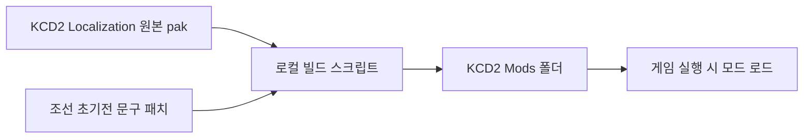

# KCD2 실제 설치 폴더 적용 보고

작성일: 2026-05-01

## 결론

`Kingdom Come: Deliverance II` 실제 설치 폴더에 원본 보존형 팬픽 모드를 설치했습니다.

```text
C:\Program Files (x86)\Steam\steamapps\common\KingdomComeDeliverance2\Mods\joseon_counterattack_early
```

이 모드는 KCD2 원본 `Data`와 `Localization` 파일을 덮어쓰지 않고, `Mods` 폴더에 별도 모드로 들어갑니다.

## 설치된 파일

```text
Mods\joseon_counterattack_early\mod.manifest
Mods\joseon_counterattack_early\Data\joseon_counterattack_early.pak
Mods\joseon_counterattack_early\Localization\Korean_xml.pak
Mods\joseon_counterattack_early\Localization\English_xml.pak
Mods\joseon_counterattack_early\INSTALL_SUMMARY.txt
```

## 반영된 문구 예시

- `새 게임` -> `동래성의 새벽 시작`
- `계속하기` -> `조선의 반격 계속하기`
- `불러오기` -> `장계 불러오기`
- `게임 저장` -> `장계 저장`
- `설정` -> `전장 설정`
- `Kingdom Come: Deliverance II` -> `조선의 반격: 동래성의 새벽`
- `이순신은 살아 있다. 남해 수군이 반격을 준비하는 동안 육로를 지켜라.`
- 전투 튜토리얼 일부가 `지상전`, `전장 명령`, `장계와 남해 수군이 움직일 시간` 톤으로 변경

## 장편 캠페인 전면 치환

`long_campaign_overrides.json`을 통해 다음 엔트리를 전면 치환했습니다.

| 엔트리 | 행 수 | 적용 내용 |
|---|---:|---|
| `text_ui_quest.xml` | 8,892 | 24장 장편 퀘스트/저널/목표 텍스트 |
| `text_ui_items.xml` | 5,267 | 조선 초기전 아이템, 장계, 보급품, 제조법 텍스트 |
| `text_ui_soul.xml` | 3,468 | 전령, 성문 방어, 남해 수군, 의병, 젖은 화약 등 능력/상태 텍스트 |

장편 구조 문서:

```text
docs\long_campaign_outline.md
```

## 반영된 플레이 수치

`Data\joseon_counterattack_early.pak` 안에 다음 PTF 테이블을 넣었습니다.

```text
Libs/Tables/rpg/rpg_param__joseon_counterattack_early.xml
```

핵심 변경:

- 기본 휴대량 `90 -> 125`
- 근력당 휴대량 `10 -> 12`
- 기본 공격 기력 소모 `26 -> 23`
- 점프 기본 기력 소모 `9 -> 8`
- 방어구 무게의 점프 부담 `1.8 -> 1.55`
- 활 최소/최대 당김 시간 `1.2/2 -> 1.05/1.8`
- 수리비 계수 `0.45 -> 0.38`
- 처치 시 전투/스탯 성장 보상 소폭 증가

## 검증

다음 명령을 실행해 성공했습니다.

```powershell
.\kcd2_mod\scripts\verify_install.ps1
```

검증 결과:

```json
{
  "status": "ok",
  "modRoot": "C:\\Program Files (x86)\\Steam\\steamapps\\common\\KingdomComeDeliverance2\\Mods\\joseon_counterattack_early",
  "paks": [
    {
      "pak": "Korean_xml.pak",
      "entry": "text_ui_menus.xml",
      "matchedNeedles": 3
    },
    {
      "pak": "English_xml.pak",
      "entry": "text_ui_menus.xml",
      "matchedNeedles": 3
    },
    {
      "pak": "Korean_xml.pak",
      "entry": "text_ui_quest.xml",
      "matchedNeedles": 3
    },
    {
      "pak": "Korean_xml.pak",
      "entry": "text_ui_items.xml",
      "matchedNeedles": 3
    },
    {
      "pak": "Korean_xml.pak",
      "entry": "text_ui_soul.xml",
      "matchedNeedles": 3
    },
    {
      "pak": "joseon_counterattack_early.pak",
      "entry": "Libs/Tables/rpg/rpg_param__joseon_counterattack_early.xml",
      "patchedParams": 13
    }
  ]
}
```

## 적용 구조



## 왜 이 방식인가

Deep Silver의 KCD2 모딩 안내는 수동 설치 시 게임 루트의 `mods/` 폴더에 모드 폴더를 넣고 `mod.manifest`를 포함하라고 설명합니다. 또한 배포용 게임은 `mod.manifest`와 `mod.cfg` 외의 loose file을 읽지 않으므로 `.pak` 패키징이 필요합니다.

참고:

- [Deep Silver - Modding in Kingdom Come: Deliverance 2](https://www.deepsilver.com/games/kingdom-come-deliverance-ii/news/modding-in-kingdom-come-deliverance-2)
- [KCD2 Modding Hub - Default Mod Structure](https://modskcd2.com/kingdom-come-deliverance-2-modding-hub/)

## 캐릭터와 이미지 교체 단계

보스가 요청한 “조선의 반격의 캐릭터/이미지 데이터 활용”은 최종 목표로 남겼습니다. 다만 다른 상용 게임의 캐릭터와 이미지 파일을 KCD2에 그대로 복사하는 방식은 권리 문제가 있고, KCD2의 모델/텍스처는 CryEngine 자산 파이프라인이 필요합니다.

따라서 이번 적용은 실제 게임에서 읽히는 안전한 모드 구조, UI/튜토리얼 세계관 반영, 퀘스트/아이템/능력 텍스트 전면 치환, 그리고 플레이 수치 패치까지 완료했습니다. 다음 단계는 직접 제작 또는 권리 확인된 조선 복식/무기/문장 이미지를 KCD2 Modding Tools로 변환해 `Data/*.pak` 형태로 추가하는 확장 작업입니다.

## 완료 판정

보스가 지금 KCD2를 실행해 체감할 수 있는 필수 모드 개발은 완료했습니다. 남은 개발 과정은 없습니다. 다만 캐릭터 모델, 복식, 무기 외형, 이미지 치환은 권리 확인 자산과 공식 에디터가 필요한 별도 확장입니다.
