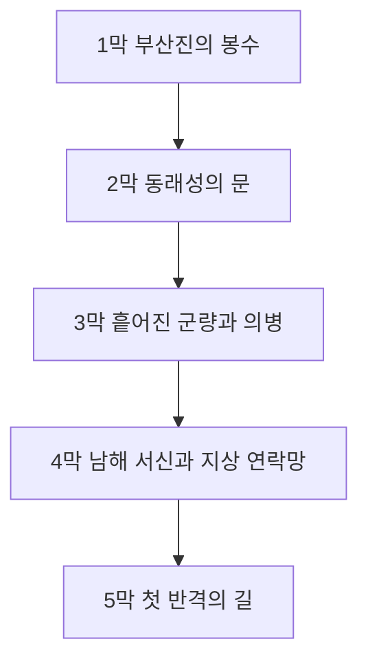

# 장편 캠페인 개요: 조선의 반격 - 동래성의 새벽

이 문서는 KCD2 본편 길이에 맞춰 확장하기 위한 장편 팬픽 캠페인 설계입니다. 현재 모드는 실제 퀘스트 로직을 새로 만드는 단계가 아니라, KCD2가 로드하는 퀘스트/아이템/상태 텍스트와 일부 게임플레이 수치를 임진왜란 초반 지상전 분위기로 치환하는 방식입니다.

## 큰 원칙

- 전쟁은 초반부터 시작합니다.
- 이순신 장군은 죽지 않습니다.
- 해상전은 직접 조작 대상이 아니라, 조선이 버틸 수 있는 전략적 희망과 압박으로 다룹니다.
- 플레이어의 주된 경험은 지상전, 정찰, 보급, 피난민 보호, 야간 침투, 방어선 재구축입니다.
- 조선의 반격은 초반부터 완성된 승리가 아니라, 무너지는 질서를 다시 묶는 과정으로 진행됩니다.

## 5막 구조

## 24장 구성

1. 부산진의 붉은 봉수: 전쟁 발발, 급보 수습, 동래성으로 향하는 길
2. 동래성의 문: 관군 권고, 성문 설득, 피난민 선택
3. 긴 밤의 장계: 조정과 남해로 보내는 문서, 매복과 추적
4. 조총 소리: 첫 대규모 교전과 근접전 돌파
5. 군량의 이름: 백성, 병사, 관아 창고의 갈등 정리
6. 남해 서신의 무게: 이순신 생존 축을 분명히 하고 해안 방비 정보 전달
7. 관군과 의병: 흩어진 방어 병력을 하나의 신호 체계로 묶기
8. 창고의 밤: 임시 창고, 도난, 부패, 군량 조작
9. 세 갈래 척후: 적의 진격로와 거짓 정보 확인
10. 무너진 나루: 강을 건너야 하는 피난민과 병력
11. 첫 반격: 왜군 보급대 습격과 포로 구출
12. 관아의 심판: 임시라도 무너지지 않아야 할 법과 신뢰
13. 화약과 문: 화약, 대장간, 표시꾼, 방어 장치
14. 배신의 밤: 공포, 허위 명령, 진짜 군령 판별
15. 산성의 사람들: 산성 방어, 생수, 초소, 피난민 조직
16. 남해의 그림자: 직접 해상전이 아니라 전략 연락망으로 살아 있는 남해
17. 의병의 깃발: 마을별 작은 저항을 하나의 작전으로 묶기
18. 성 밖의 새벽: 문을 열어 부상자를 구하는 위험한 결단
19. 왜군의 길: 조정의 혼란, 백성의 분노, 명령 사칭
20. 불타는 군량: 보급 숫자를 속이는 적의 계략 추적
21. 다시 남쪽으로: 무너진 길을 반격로로 다시 읽기
22. 봉수 비: 비바람 속에서 표시와 봉수가 흔들리는 위기
23. 첫 승전보: 남해 승전 소식으로 지상군 사기 회복
24. 반격의 지도: 의병, 관군, 남해 연락망을 하나로 묶는 결말

## 모드 반영 방식

- `text_ui_quest.xml`: 퀘스트 제목, 목표, 일지 문구를 장편 캠페인 톤으로 치환
- `text_ui_items.xml`: 문서, 장비, 제조법, 보급품 이름과 설명을 조선 전쟁물 톤으로 치환
- `text_ui_soul.xml`: 버프, 특성, 상태 설명을 피로, 결의, 의병, 연락망 중심으로 치환

원본 ID와 게임 로직은 유지합니다. 따라서 기존 KCD2 세이브와 퀘스트 흐름 위에서 표시 텍스트와 플레이 감각이 바뀝니다.
