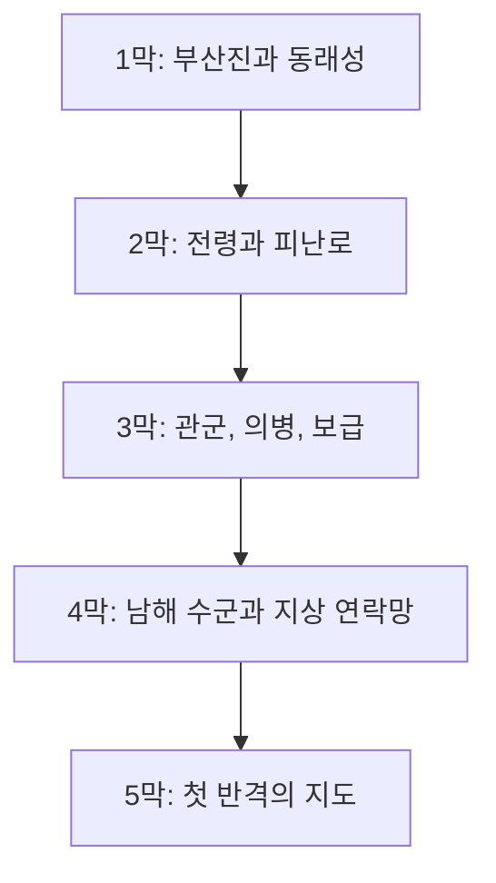

# 장편 캠페인 설계: 조선의 반격 - 동래성의 새벽

## 목표

KCD2 본편처럼 긴 여정을 가진 전쟁 초반 지상전 캠페인으로 확장합니다. 실제 KCD2 퀘스트 로직 자체를 새로 만드는 것은 공식 Modding Tools와 레벨/스크립트 작업이 필요하므로, 이번 적용은 게임 안에 표시되는 퀘스트·아이템·능력 텍스트를 장편 캠페인으로 전면 치환하는 방식입니다.

## 전체 구조

## 5막 구성

1. 부산진의 붉은 봉수: 전쟁 발발, 부산진 급보, 동래성으로 향하는 길.
2. 동래성의 문: 항복 권고, 성문 혼란, 관아와 백성의 선택.
3. 길 위의 장계: 조정과 수군영으로 나뉘는 문서, 매복과 추적.
4. 조총 소리: 적 사격 대열을 이해하고 근접전으로 돌파.
5. 피난 행렬: 백성, 군량, 병사, 패잔병의 갈등을 정리.
6. 남해 수군의 편지: 이순신 생존 축을 분명히 하고 해안 방비 정보 전달.
7. 관군과 의병: 흩어진 방어세력을 하나의 신호 체계로 묶기.
8. 창고의 밤: 전시 창고, 화살, 붕대, 군량, 장부 조작.
9. 왜군 척후: 적의 진격로와 거짓 정보.
10. 무너진 나루: 강을 건너야 하는 소식과 사람들.
11. 첫 반격: 적 보급대 야습과 포로 구출.
12. 관아의 재판: 전시에도 무너지지 않아야 할 법과 신뢰.
13. 화약과 물: 젖은 화약, 대장간, 활시위, 전쟁의 후방.
14. 밀서: 배신, 공포, 거짓 명령과 진짜 피난로.
15. 산성의 사람들: 산성 방어, 식수, 초소, 피난민 조직.
16. 수군의 그림자: 직접 해상전이 아니라 지상 연락망으로 살아 있는 수군.
17. 의병의 깃발: 마을별 원한을 하나의 작전으로 묶기.
18. 성 밖의 새벽: 문을 열어 부상자를 구하는 위험한 결단.
19. 임금의 길: 조정의 피난, 백성의 분노, 왕명 사칭.
20. 불타는 장부: 보급 숫자를 되살려 굶주림을 늦추기.
21. 다시 남쪽으로: 밀려난 길을 반격로로 다시 읽기.
22. 붉은 비: 비바람, 젖은 활시위, 흔들리는 사기.
23. 첫 승전보: 수군의 승전 소식으로 지상군 사기 회복.
24. 반격의 지도: 의병로, 관군로, 수군 연락로를 하나로 잇기.

## 적용 방식

`long_campaign_overrides.json`이 다음 항목을 전면 치환합니다.

- `text_ui_quest.xml`: 모든 퀘스트/저널 표시 행
- `text_ui_items.xml`: 모든 아이템/제조법 표시 행
- `text_ui_soul.xml`: 모든 능력/버프/상태 표시 행

원본 ID와 게임 로직은 유지하고 표시 텍스트만 바꿉니다. 따라서 기존 KCD2 세이브와 퀘스트 트리 위에서 작동하며, 게임이 로드하는 pak 구조도 유지됩니다.
