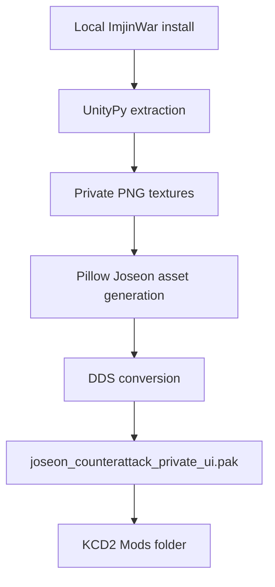

# Joseon Visual Asset Pack

[한국어](visual_asset_pack.md)

This local-only stage uses textures extracted from the installed `Imjin War: Joseon Counterattack` client as references/composites, then creates original Joseon-style KCD2 DDS assets without committing commercial assets to the public repository.

## Installed Output

```text
C:\Program Files (x86)\Steam\steamapps\common\KingdomComeDeliverance2\Mods\joseon_counterattack_early\Data\joseon_counterattack_private_ui.pak
```

## Build

```powershell
.\kcd2_mod\scripts\build_private_imjinwar_bridge.ps1
.\kcd2_mod\scripts\verify_visual_asset_pack.ps1
```

`build_private_imjinwar_bridge.ps1` extracts Unity assets and then automatically calls `build_visual_asset_pack.ps1 -Profile safe`. If extraction is already done, rebuild only the safe visual pack:

```powershell
.\kcd2_mod\scripts\build_visual_asset_pack.ps1
```

## Coverage

- 20 safe-profile DDS entries
- Icons for hwando sword, beacon bow, gate shield, sealed dispatch, ration, powder, uniform, and field medicine
- Campaign maps and document images inspired by the Busanjin/Dongnae land front
- No broad UI, book-decoration, or city-material override entries in the default profile



## Verification

`verify_visual_asset_pack.ps1` checks that the private PAK exists, contains at least 20 entries, includes the required map/item/document paths, and does not include broad UI or city-material override paths in the safe profile.

Generated previews and manifests stay in a Git-ignored local folder:

```text
assets\game-captures-private\kcd2_visual_pack\
```

## Experimental Full Profile

The `full` profile creates 54 DDS entries and includes city-material overrides. It can make the live game look broken, so it is no longer the default.

```powershell
.\kcd2_mod\scripts\build_visual_asset_pack.ps1 -Profile full
.\kcd2_mod\scripts\verify_visual_asset_pack.ps1 -Profile full
```
