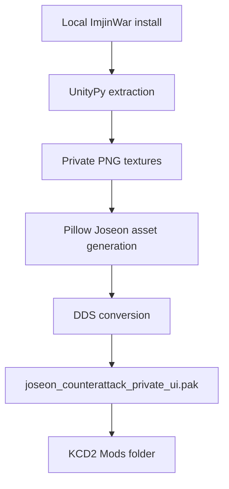

# Joseon Visual Asset Pack

[한국어](visual_asset_pack.md)

This local-only stage uses textures extracted from the installed `Imjin War: Joseon Counterattack` client as references/composites, then creates original Joseon-style KCD2 DDS assets without committing commercial assets to the public repository.

## Installed Output

```text
C:\Program Files (x86)\Steam\steamapps\common\KingdomComeDeliverance2\Mods\joseon_counterattack_early\Data\joseon_counterattack_private_ui.pak
```

## Build

```powershell
.\kcd2_mod\scripts\build_private_imjinwar_bridge.ps1
.\kcd2_mod\scripts\verify_visual_asset_pack.ps1
```

`build_private_imjinwar_bridge.ps1` extracts Unity assets and then automatically calls `build_visual_asset_pack.ps1`. If extraction is already done, rebuild only the visual pack:

```powershell
.\kcd2_mod\scripts\build_visual_asset_pack.ps1
```

## Coverage

- 44 UI/book/map/item DDS entries
- 10 city-material diffuse DDS entries
- Joseon gate, beacon-fire, fortress wall, market/alley, and campaign-map backgrounds
- Icons for hwando sword, beacon bow, gate shield, sealed dispatch, ration, powder, uniform, and field medicine
- Hanok plaster, stone wall, wooden gate, beams, and hanji window material overrides



## Verification

`verify_visual_asset_pack.ps1` checks that the private PAK exists, contains at least 54 entries, and includes the required UI, codex, map, item, and city-material override paths.

Generated previews and manifests stay in a Git-ignored local folder:

```text
assets\game-captures-private\kcd2_visual_pack\
```
