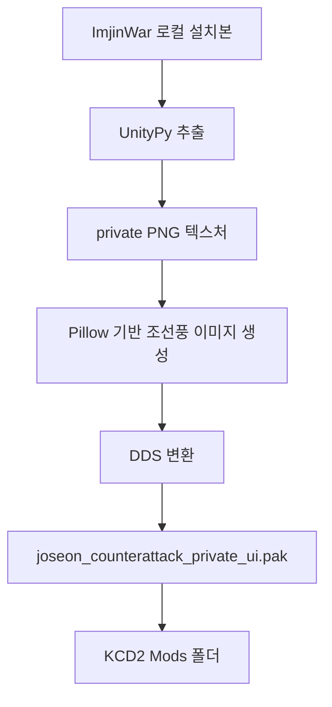

# 조선풍 비주얼 팩

[English](visual_asset_pack.en.md)

보스 PC의 `임진왜란 조선의 반격` 설치본에서 추출한 로컬 텍스처를 참고하고, 공개 저장소에는 상용 자산을 넣지 않는 방식으로 KCD2용 조선풍 비주얼 PAK를 만듭니다.

## 적용 위치

```text
C:\Program Files (x86)\Steam\steamapps\common\KingdomComeDeliverance2\Mods\joseon_counterattack_early\Data\joseon_counterattack_private_ui.pak
```

## 생성 명령

```powershell
.\kcd2_mod\scripts\build_private_imjinwar_bridge.ps1
.\kcd2_mod\scripts\verify_visual_asset_pack.ps1
```

`build_private_imjinwar_bridge.ps1`는 Unity 자산을 추출한 뒤 `build_visual_asset_pack.ps1`를 자동으로 호출합니다. 이미 추출이 끝난 상태에서 비주얼만 다시 만들 때는 다음 명령만 실행하면 됩니다.

```powershell
.\kcd2_mod\scripts\build_visual_asset_pack.ps1
```

## 반영 범위

- UI/책/지도/아이템 DDS 44개
- 도시 구조물 diffuse DDS 10개
- 조선풍 성문, 봉수, 동래성식 성벽, 시장/골목, 작전 지도 배경
- 환도, 봉수대 활, 성문 수비 방패, 장계, 보급 식량, 방습 화약, 전장 의약품 아이콘
- 한옥 회벽, 석축, 목재 대문, 들보, 한지창 재질



## 검증 결과 기준

`verify_visual_asset_pack.ps1`는 다음을 확인합니다.

- private PAK 존재
- 54개 이상 엔트리 포함
- 아이템 선택 UI, 코덱스 도시 배경, 지도, 제품/재료 아이콘 포함
- 회벽/석벽/목재/한지창 도시 재질 오버라이드 포함

생성 미리보기와 매니페스트는 Git에 올라가지 않는 로컬 전용 폴더에 저장됩니다.

```text
assets\game-captures-private\kcd2_visual_pack\
```
