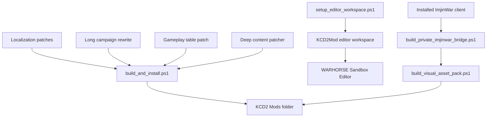

# KCD2 Joseon Counterattack Early-War Mod

[한국어](README.ko.md)

This folder builds a local fan mod for the installed copy of `Kingdom Come: Deliverance II`. It does not overwrite original game files. It installs a separate KCD2 manual mod under `Mods/<modid>`.

## Direction

- Opening period: early Imjin War, 1592
- Focus: Busanjin, Dongnae, inland defense, supply lines, beacons, militia and official army reorganization
- Gameplay tone: land combat, scouting, courier work, night movement, defense and counterattack
- Story rule: Admiral Yi Sun-sin stays alive; the navy remains a strategic background force
- Distribution rule: do not publish repacked commercial game assets

## Installed Path

```text
C:\Program Files (x86)\Steam\steamapps\common\KingdomComeDeliverance2\Mods\joseon_counterattack_early
```

## Build And Verify

```powershell
cd "C:\Users\sinmb\Documents\New project 2\imjin-war-joseon-counterattack-story-lab"
.\kcd2_mod\scripts\build_and_install.ps1
.\kcd2_mod\scripts\verify_install.ps1
```

## Deep Content Layer

The build now runs `tools/kcd2_deep_content_patch.py` after the base localization/gameplay pass. It rewrites:

- 271 codex rows around the early Imjin War, Busanjin/Dongnae, dispatches, beacons, militias, and the rule that Yi Sun-sin survives
- 5,267 item rows into Joseon land-front names and descriptions such as `Dongnae Longsword`, `Beacon-Post Bow`, `Gate Guard Shield`, and `Powderproofing Formula`
- 2,498 character/perk/buff rows into Joseon-front roles and traits
- player starter inventory, clothing preset, and weapon preset for a courier/guard loadout

## ImjinWar Asset Bridge

The installed `Imjin War: Joseon Counterattack` client was found here:

```text
C:\Program Files (x86)\Joycity\ImjinWar
```

The private bridge extracts selected Unity Texture2D/TextAsset data into a git-ignored local folder and creates a local-only KCD2 UI PAK:

```powershell
.\kcd2_mod\scripts\build_private_imjinwar_bridge.ps1
.\kcd2_mod\scripts\verify_private_imjinwar_bridge.ps1
.\kcd2_mod\scripts\verify_visual_asset_pack.ps1
```

Generated local outputs:

```text
assets\game-captures-private\imjinwar_extract\
C:\Program Files (x86)\Steam\steamapps\common\KingdomComeDeliverance2\Mods\joseon_counterattack_early\Data\joseon_counterattack_private_ui.pak
```

These files are for local play only and are not committed to the public repository.

The expanded visual pack writes Joseon-style item icons, codex backgrounds, campaign maps, city/fortress scenes, and hanok plaster, stone, wood, beam, and hanji-window material overrides into the same private PAK. The current verified pack contains 54 DDS entries.

## Official Editor

The official KCD2 modding tools are installed here:

```text
C:\Program Files (x86)\Steam\steamapps\common\KCD2Mod
```

Launch the editor:

```powershell
.\kcd2_mod\scripts\launch_editor.ps1
```

If the editor shows `Database system error`, rebuild the workspace links:

```powershell
.\kcd2_mod\scripts\setup_editor_workspace.ps1
```

## Structure


