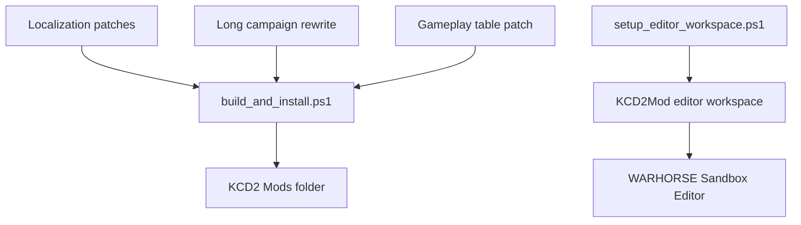

# KCD2 Joseon Counterattack Early-War Mod

[한국어](README.ko.md)

This folder builds a local fan mod for the installed copy of `Kingdom Come: Deliverance II`. It does not overwrite original game files. It installs a separate KCD2 manual mod under `Mods/<modid>`.

## Direction

- Opening period: early Imjin War, 1592
- Focus: Busanjin, Dongnae, inland defense, supply lines, beacons, militia and official army reorganization
- Gameplay tone: land combat, scouting, courier work, night movement, defense and counterattack
- Story rule: Admiral Yi Sun-sin stays alive; the navy remains a strategic background force
- Distribution rule: do not publish repacked commercial game assets

## Installed Path

```text
C:\Program Files (x86)\Steam\steamapps\common\KingdomComeDeliverance2\Mods\joseon_counterattack_early
```

## Build And Verify

```powershell
cd "C:\Users\sinmb\Documents\New project 2\imjin-war-joseon-counterattack-story-lab"
.\kcd2_mod\scripts\build_and_install.ps1
.\kcd2_mod\scripts\verify_install.ps1
```

## Official Editor

The official KCD2 modding tools are installed here:

```text
C:\Program Files (x86)\Steam\steamapps\common\KCD2Mod
```

Launch the editor:

```powershell
.\kcd2_mod\scripts\launch_editor.ps1
```

If the editor shows `Database system error`, rebuild the workspace links:

```powershell
.\kcd2_mod\scripts\setup_editor_workspace.ps1
```

## Structure


