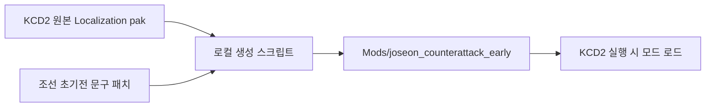

# KCD2 조선의 반격 초기전 모드

이 폴더는 보스의 PC에 설치된 `Kingdom Come: Deliverance II`를 원본 보존형 모드 방식으로 바꾸기 위한 작업본입니다.

현재 적용 목표는 `임진왜란: 조선의 반격`의 분위기를 직접 복제하는 것이 아니라, KCD2의 실제 실행 폴더에 안전하게 읽히는 팬픽 모드를 배치해서 전쟁 초기 조선 지상전 분위기가 게임 안 UI에 먼저 드러나게 하는 것입니다. 이순신 장군은 사망 처리하지 않고, 전쟁 초기 남해 수군의 살아있는 전략 축으로 유지합니다.

영문 설명은 [README.en.md](README.en.md)에서 볼 수 있습니다.

## 적용된 방향

- 시작 시점: 1592년 전쟁 초, 부산진과 동래성 압박 직후의 육상 방어전
- 핵심 인물 원칙: 이순신 장군 생존, 수군은 배경 전략축, 플레이 감각은 지상전
- 게임 적용 방식: KCD2 공식 수동 모드 구조인 `Mods/<modid>/mod.manifest`와 `Localization/*.pak`
- 장편 적용: 퀘스트/아이템/능력 텍스트를 24장 장기 캠페인으로 전면 치환
- 플레이 수치: 전령/보급병 플레이를 위해 휴대량, 공격 기력 소모, 활 조작, 수리비, 성장 보상 조정
- 저작권 경계: 다른 게임의 이미지/캐릭터 파일을 직접 복사하지 않고, 보스의 로컬 설치본에서만 패키지를 생성

## 구조

```text
kcd2_mod/
  patches/localization_overrides.json   바꿀 UI 문구 목록
  patches/long_campaign_overrides.json  퀘스트/아이템/능력 전면 장편 치환 목록
  patches/gameplay_overrides.json       전투/보급/이동 수치 패치 목록
  scripts/build_and_install.ps1         KCD2 Mods 폴더에 모드 생성/설치
  scripts/verify_install.ps1            설치된 모드 pak 검증
  scenario/early_campaign.md            초기 시나리오 설계
  templates/mod.manifest                KCD2 모드 매니페스트 템플릿
```



## 실행

관리자 권한 PowerShell에서 다음을 실행합니다.

```powershell
.\kcd2_mod\scripts\build_and_install.ps1
.\kcd2_mod\scripts\verify_install.ps1
```

설치 경로는 기본값으로 다음을 사용합니다.

```text
C:\Program Files (x86)\Steam\steamapps\common\KingdomComeDeliverance2
```

## 현재 단계의 한계

이번 적용은 실제 KCD2 설치 폴더에 들어가는 플레이 가능 장편 텍스트/게임플레이 모드입니다. 다만 캐릭터 모델과 이미지 교체까지 무리하게 덮어쓰지는 않았습니다. 그 작업은 KCD2 공식 Modding Tools, CryEngine 자산 변환, 그리고 권리 문제가 확인된 원본/직접 제작 자산이 필요합니다. 현재 단계에서 안전하게 완료 가능한 필수 개발은 끝났고, 모델/복식/무기 비주얼은 후속 확장 영역입니다.
