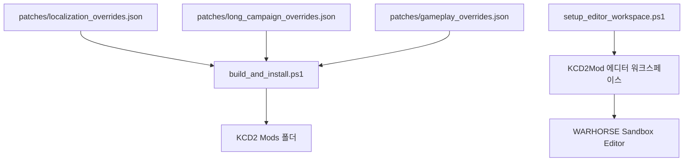

# KCD2 조선의 반격 초기전 모드

[English](README.en.md)

이 폴더는 보스 PC에 설치된 `Kingdom Come: Deliverance II`에 적용되는 로컬 팬픽 모드입니다. KCD2 원본 파일을 직접 덮어쓰지 않고, 공식 수동 모드 구조인 `Mods/<modid>` 아래에 별도 패키지를 배치합니다.

## 방향

- 시작 시점: 1592년 임진왜란 초반
- 중심 무대: 부산진, 동래성, 남부 내륙 방어선, 보급로
- 플레이 감각: 해상전이 아니라 KCD2에 맞는 지상전, 정찰, 수송, 야간 침투, 방어전
- 핵심 원칙: 이순신 장군은 살아 있으며, 해상 전략망은 배경 압력과 희망의 축으로 유지
- 권리 경계: 다른 상용 게임의 이미지와 캐릭터 파일은 배포하지 않음

## 설치 위치

```text
C:\Program Files (x86)\Steam\steamapps\common\KingdomComeDeliverance2\Mods\joseon_counterattack_early
```

## 빌드와 검증

```powershell
cd "C:\Users\sinmb\Documents\New project 2\imjin-war-joseon-counterattack-story-lab"
.\kcd2_mod\scripts\build_and_install.ps1
.\kcd2_mod\scripts\verify_install.ps1
```

검증이 성공하면 `status: ok`가 출력됩니다. 검증 대상은 다음입니다.

- `Localization\Korean_xml.pak`
- `Localization\English_xml.pak`
- `Data\joseon_counterattack_early.pak`
- `text_ui_menus.xml`
- `text_ui_tutorials.xml`
- `text_ui_quest.xml`
- `text_ui_items.xml`
- `text_ui_soul.xml`
- `Libs/Tables/rpg/rpg_param__joseon_counterattack_early.xml`

## 공식 에디터

공식 모딩툴은 Steam 도구 앱으로 설치되어 있습니다.

```text
C:\Program Files (x86)\Steam\steamapps\common\KCD2Mod
```

에디터 실행:

```powershell
.\kcd2_mod\scripts\launch_editor.ps1
```

`Database system error`가 뜨면 본편 PAK 연결이 빠진 것입니다. 아래 스크립트로 복구합니다.

```powershell
.\kcd2_mod\scripts\setup_editor_workspace.ps1
```

## 구조



## 현재 한계

이 버전은 플레이 가능한 로컬 모드 패키지와 에디터 환경을 완성한 단계입니다. 캐릭터 모델, 복식, 무기 외형, UI 아이콘 전체 교체는 공식 에디터와 별도 자산 파이프라인에서 계속 확장할 수 있습니다. 공개 저장소에는 상용 게임 자산을 포함하지 않습니다.
